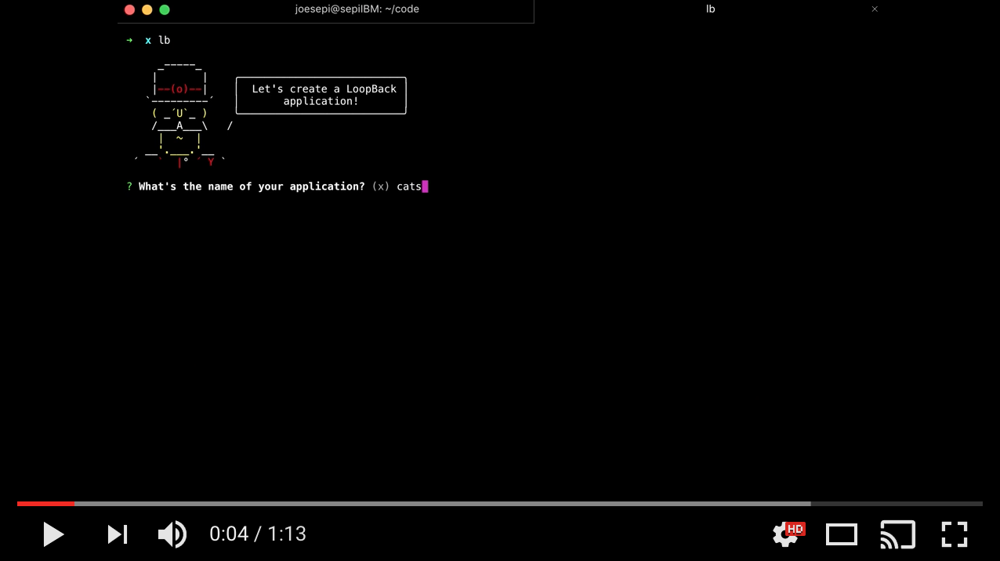

## What is LoopBack?

LoopBack is a framework to rapidly build RESTful APIs in Node.js.  It uses a command line interface (CLI) to scaffold your application and build out your API layer. It is fast and easy, but robust and extensible. It is built on top of Express, so it has widely-used and very stable foundation. It is so awesome, it is almost magical. Let me show you:

## Prerequisites

#### Node.js and NPM

As mentioned previously, we will need Node.js installed on our local machine for development. Included with Node.js is NPM, the Node Package Manager. We will use NPM to install LoopBack in a moment, first lets see if we have Node and NPM:

Check for Node: `node --version`

This should yield a version number. A number greater than 4 should suffice. If you do not have Node installed, see [nodejs.org](https://nodejs.org) for more details on getting it for your platform.

To be safe, let's check NPM as well: `npm --version`

This should also yield a version number; anything greater than 3 is preferable. If you do not have NPM, you likely do not have Node. If so, see above. If you have Node and not NPM, please reinstall Node.

#### LoopBack CLI

Once we have confirmed we have Node.js and NPM, let's install LoopBack if we haven't already:

Check if LoopBack is installed: `lb --version`

This should yield a version number for the loopback cli. Any version number should do. If you do not have LoopBack installed, run the following command to install the LoopBack CLI:

`npm install -g loopback-cli`

This will install LoopBack globally (`-g`) to your machine so you can start a LoopBack application in any directory you choose.

Next Step: [Let's initialize our application](01-init.md).
