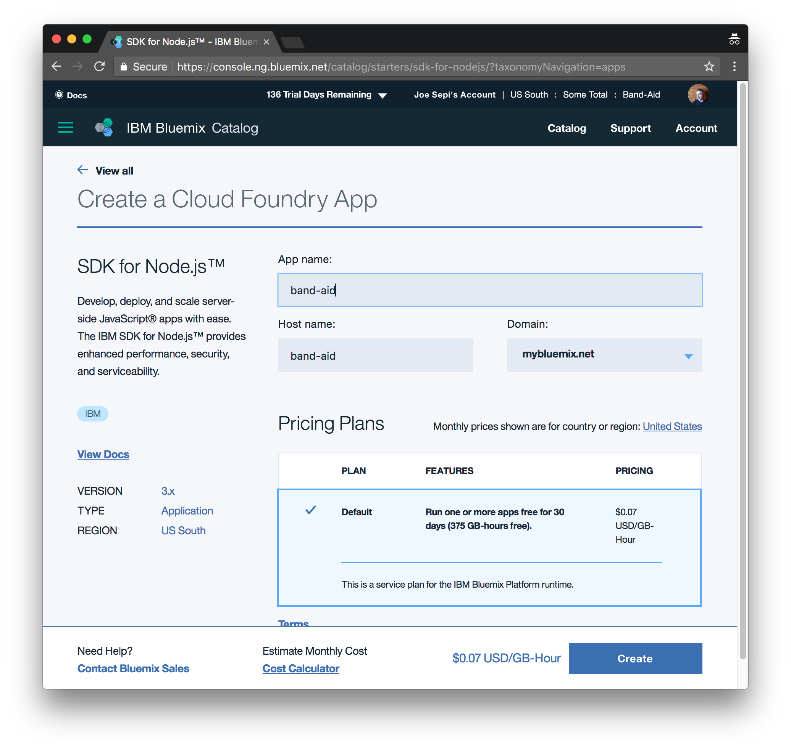

# Deploy

LoopBack is simply a Node.js app, so we can deploy it wherever Node.js is supported. In this step though, we will walk through how to deploy it on Bluemix, IBM's Paas (platform as a service). We will use their Cloud Foundry tools to configure and manage the deployment.


## Create Node.js Cloud Foundry app:

In this step, we need to go into the Bluemix site and from the Cloud Foundry section of their catalog, we will choose to create a Node.js Runtime App. Choosing the default options will do for now.

**The catalog:**


**Create the Node.js app**



_Note: take notice of the org and space you created this app in. It is likely you only have one of each, but it is not uncommon to have more than one of one or the other._

The page that is presented after creating our Node.js app shows your app starting up. We can now switch back to the terminal and our editor.

On this page, we will also see some instructions for using a sample app and getting started. We are going to skip that in favor of the following steps:

## Create our `manifest.yml` file

Let's go into the root of our Node.js application and create a `manifest.yml` file and add the following information, changing "name" to the name we chose when creating the Cloud Foundry app.

It should look something like so:

```
---
applications:
 - name: band-aid
   random-route: true
   memory: 256M
```

## Get Cloud Foundry

At this point, we are going to begin using the Cloud Foundry cli. It is required that we install this toolkit before going further.

The most common way of installing Cloud Foundry on a Mac is to use Homebrew:

```
$ brew tap cloudfoundry/tap
$ brew install cf-cli
```

To find instructions for other platforms, see [this page](https://github.com/cloudfoundry/cli#downloads)

## Login `cf login`

The first thing we need to do is log in. Doing so, it will prompt us for email, password, organization and space.

In the terminal, let's run `cf login`:

```
➜  band-aid git:(master) ✗ cf login
API endpoint: https://api.ng.bluemix.net

Email> joesepi@ibm.com

Password>
Authenticating...
OK

Select an org (or press enter to skip):
1. StrongLoop Evangelists Org
2. Some Total

Org> 2
Targeted org Some Total

Select a space (or press enter to skip):
1. dev-unkempt
2. BMLabs-PROD
3. dev
4. eventquarry-dev
5. Band-Aid

Space> 5
Targeted space Band-Aid


API endpoint:   https://api.ng.bluemix.net (API version: 2.54.0)
User:           joesepi@ibm.com
Org:            Some Total
Space:          Band-Aid
```

Looks like we were successful.

## Set Region `cf api`

Now we need to set the region for Bluemix. There are only 3, so we just need to match it up with the region our Org/Space is using in Bluemix. Here are the three options:

|API endpoint                   |Region
|---                            |---
|https://api.ng.bluemix.net	|US South
|https://api.eu-gb.bluemix.net	|United Kingdom
|https://api.au-syd.bluemix.net	|Sydney

The region that I am using is US South, so you will see that set below (and also in the output above).

In the terminal, let's run `cf api <your-region-api>`:

```
➜  band-aid git:(master) ✗ cf api https://api.ng.bluemix.net
Setting api endpoint to https://api.ng.bluemix.net...
OK


API endpoint:   https://api.ng.bluemix.net (API version: 2.54.0)
User:           joesepi@ibm.com
Org:            Some Total
Space:          Band-Aid
```

## Push our code `cf push`

We can push our code to Bluemix by running the `cf push` command. Doing so will use our `manifest.yml` file and the settings we have just chosen to deploy our app in the cloud.

```
➜  band-aid git:(master) ✗ cf push
Using manifest file /Users/joesepi/code/workshop-band-app/band-aid/manifest.yml

Updating app band-aid in org Some Total / space Band-Aid as joesepi@ibm.com...
OK

Uploading band-aid...
Uploading app files from: /Users/joesepi/code/workshop-band-app/band-aid
Uploading 10.7M, 10822 files
Done uploading
OK

Stopping app band-aid in org Some Total / space Band-Aid as joesepi@ibm.com...
OK

Starting app band-aid in org Some Total / space Band-Aid as joesepi@ibm.com...
Downloading liberty-for-java_v3_5-20161114-1152...
```

Beyond this, there is a lot of output about things downloading and such, but after the app is prepared and then started, we will something along these lines in your terminal:

```
Exit status 0
Staging complete
Uploading droplet, build artifacts cache...
Uploading build artifacts cache...
Uploading droplet...
Uploaded build artifacts cache (11.9M)
Uploaded droplet (28.6M)
Destroying container
Successfully destroyed container

0 of 1 instances running, 1 starting
1 of 1 instances running

App started


OK

App band-aid was started using this command `./vendor/initial_startup.rb`

Showing health and status for app band-aid in org Some Total / space Band-Aid as joesepi@ibm.com...
OK

requested state: started
instances: 1/1
usage: 256M x 1 instances
urls: band-aid.mybluemix.net
last uploaded: Tue Feb 28 22:15:28 UTC 2017
stack: cflinuxfs2
buildpack: SDK for Node.js(TM) (ibm-node.js-4.7.2, buildpack-v3.10-20170119-1146)

     state     since                    cpu    memory           disk           details
#0   running   2017-02-28 05:16:58 PM   0.0%   117.7M of 256M   140.4M of 1G
```

At this point, our app is in the cloud and we can visit the app at the urls stated in the output above: `urls: band-aid.mybluemix.net` (_your url may be slightly different_)

## Show our app status `cf apps`

And at any point, we can check our apps by running `cf apps`. The output should looks something like:

```
➜  band-aid git:(master) ✗ cf apps
Getting apps in org Some Total / space Band-Aid as joesepi@ibm.com...
OK

name       requested state   instances   memory   disk   urls
band-aid   started           1/1         256M     1G     band-aid.mybluemix.net
```

**Next Step:** [Connect a datasource](06-datasource.md)

